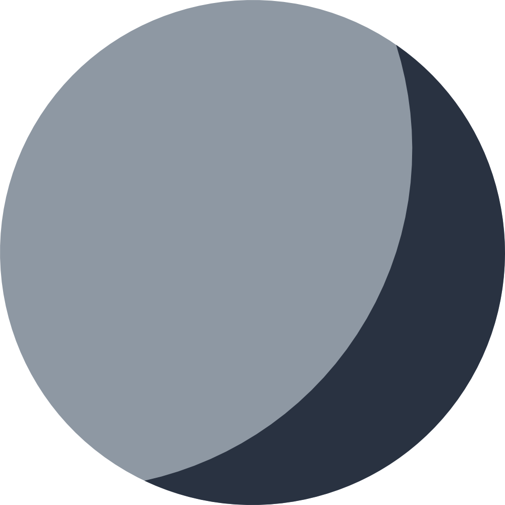

# Luna

Inspired by [Lucid](https://github.com/tensorflow/lucid), **Luna** is a Feature Visualization package for Tensorflow.
While Lucid does not support Tensorflow 2, **Luna** was built with Tensorflow 2 at its core.

**Luna is under active development. It is research code and not production-ready.**

To learn how to use Luna and for insights into its API, see our [documentation](http://a13x.io/luna/).

## Contributing

We greatly appreciate any effort to improve **Luna**.
If you want to contribute to its development, see our [contribution guidelines](./CONTRIBUTING.md).

## Recomended Reading

- [Feature Visualization](https://distill.pub/2017/feature-visualization/)
- [The Building Blocks of Interpretability](https://distill.pub/2018/building-blocks/)
- [Using Artificial Intelligence to Augment Human Intelligence](https://distill.pub/2017/aia/)
- [Visualizing Representations: Deep Learning and Human Beings](http://colah.github.io/posts/2015-01-Visualizing-Representations/)
- [Differentiable Image Parameterizations](https://distill.pub/2018/differentiable-parameterizations/)
- [Activation Atlas](https://distill.pub/2019/activation-atlas/)

## Related Talks

- [Lessons from a year of Distill ML Research](https://www.youtube.com/watch?v=jlZsgUZaIyY) (Shan Carter, OpenVisConf)
- [Machine Learning for Visualization](https://www.youtube.com/watch?v=6n-kCYn0zxU) (Ian Johnson, OpenVisConf)

## Community

While we admire their work, we have no affiliation with the Lucid authors or project. Nonetheless, if you are interested in research like this, the Distill slack ([join link](http://slack.distill.pub)) might be a good place for you to get to know other people in this area.

On the awesome Distill slack, Lucid has its own `#proj-lucid` channel, where general questions about the technology are discussed.
